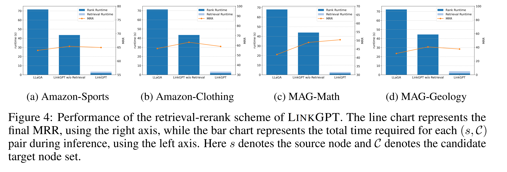

# LinkGPT

## Introduction

This is the official implementation of paper [LinkGPT: Teaching Large Language Models To Predict Missing Links]( https://arxiv.org/abs/2406.04640 ).


## Environment Preparation

```bash
# clone this repo
git clone https://github.com/twelfth-star/LinkGPT.git
cd LinkGPT

# create the conda environment
conda create -n linkgpt python=3.9
conda activate linkgpt

# install pytorch (refer to https://pytorch.org/get-started/previous-versions/ for other cuda versions)
conda install pytorch==1.13.1 torchvision==0.14.1 torchaudio==0.13.1 pytorch-cuda=11.7 -c pytorch -c nvidia

# install other dependencies
pip install -r requirements.txt
```

## Data Preparation

Download the data from [here](https://drive.google.com/file/d/1aQQDYuub_a4KSOkWntOJNwmtwtkHRCHl/view?usp=sharing) and extract it into `LinkGPT/data`. You may also save the data in any other location, but you will need to modify the `LINKGPT_DATA_PATH` variable in all scripts accordingly. The structure of the data should look like the following tree diagram.

```bash
.
└── datasets
    ├── amazon_clothing_20k
    │   ├── dataset_for_lm.pkl
    │   ├── eval_yn_dataset_0_examples.pkl
    │   ├── eval_yn_dataset_2_examples.pkl
    │   ├── eval_yn_dataset_4_examples.pkl
    │   ├── eval_yn_dataset_large_candidate_set.pkl
    │   ├── ft_np_dataset.pkl
    │   ├── ft_yn_dataset.pkl
    │   ├── ppr_data.pt
    │   └── text_emb_cgtp.pt
    ├── amazon_sports_20k
    │   └── ... (same as above)
    ├── mag_geology_20k
    │   └── ...
    └── mag_math_20k
        └── ...
```

(Optional) You can also generate the `ppr_data.pt` and `text_emb_cgtp.pt` files based on `dataset_for_lm.pkl` by yourself by running the following command. Refer to the script for more details.

```bash
bash scripts/{dataset_name}/preparation.sh
```

## Training

You may use the following command to train the model by yourself. The model checkpoints will be saved in `LinkGPT/data/models`.

```bash
bash scripts/{dataset_name}/train_linkgpt.sh
```


You may also download the fine-tuned models from [here](https://drive.google.com/file/d/17h3ToYyZFp9dcQ9FJjLL6KT-KvrN1BpH/view?usp=sharing
) and extract them into `LinkGPT/data`. The structure of the models should look like the following tree diagram.

```bash
└── models
    ├── amazon_clothing_20k
    │   └── linkgpt-llama2-7b-cgtp
    │       ├── stage1
    │       │   ├── linkgpt_special_token_emb.pt
    │       │   ├── lora_model
    │       │   │   ├── adapter_config.json
    │       │   │   ├── adapter_model.safetensors
    │       │   │   └── README.md
    │       │   ├── node_alignment_proj.pt
    │       │   ├── pairwise_alignment_proj.pt
    │       │   └── pairwise_encoder.pt
    │       └── stage2
    │           └── ... (same as stage1)
    ├── amazon_sports_20k
    │   └── ... (same as above)
    ├── mag_geology_20k
    │   └── ...
    └── mag_math_20k
        └── ...
```

## Evaluation


To reproduce the results in Table 1 (LinkGPT w/o retrieval), you may use the following command to evaluate the model. The evaluation results will be saved in `LinkGPT/data/eval_output`.
 
```bash
bash scripts/{dataset_name}/eval_rank.sh
```



To reproduce the results in Figure 4 (LinkGPT w/ retrieval), you may use the following commands to evaluate the model. The evaluation results will also be saved in `LinkGPT/data/eval_output`.

```bash
bash scripts/{dataset_name}/eval_retrieval_rerank.sh
```

## Citation

If you find this work helpful, please consider citing our paper. Thank you!

```bibtex
@article{he2024linkgpt,
  title={LinkGPT: Teaching Large Language Models To Predict Missing Links},
  author={He, Zhongmou and Zhu, Jing and Qian, Shengyi and Chai, Joyce and Koutra, Danai},
  journal={arXiv preprint arXiv:2406.04640},
  year={2024}
}
```
